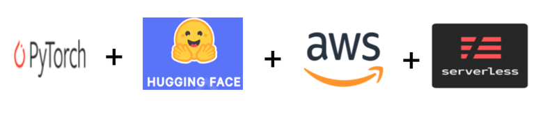
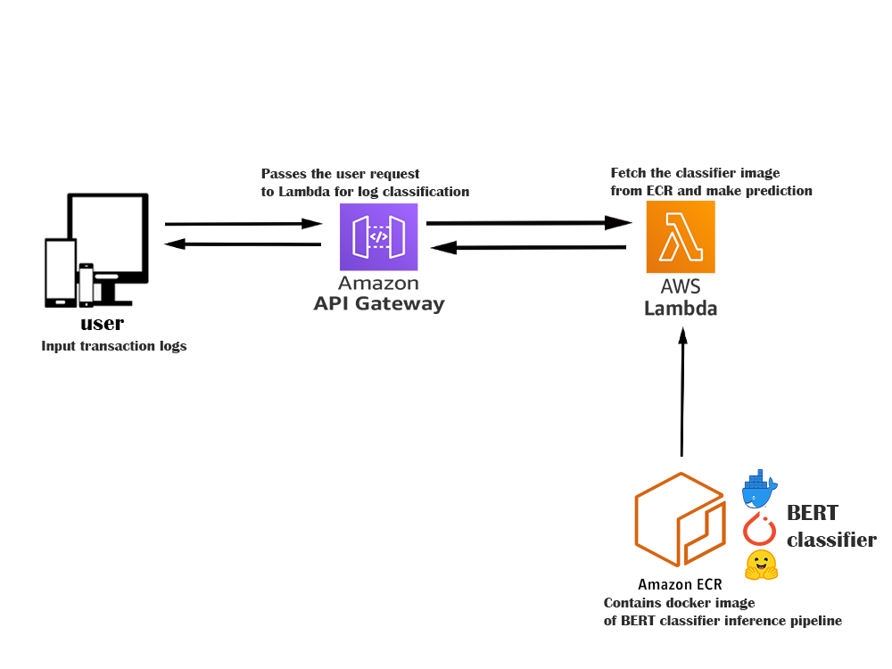
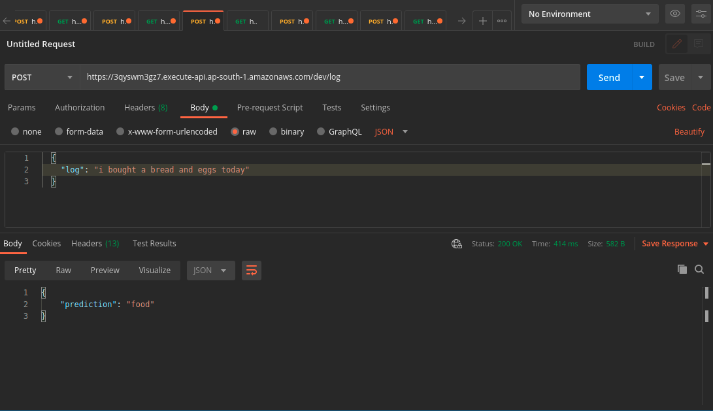

<h3 style="text-align:center; font-weight: bold">
 Serve PyTorch model as an API using AWS + serverless framework
</h3>

**BAAS** - BERT As A Service, here we will be deploying a trained BERT model using serverless infrastructure.
The above BERT model is used to classify user daily transaction logs to the following classes.
> Food, Transport, Bills, Shopping. Credit

## Model building

To train the BERT model 

Note: upload the processed.csv file, which the training data

## Serving Model using Lambda + serverless framework

### Architecture

## API results

## Tutorial

For complete tutorial please read my medium blog

